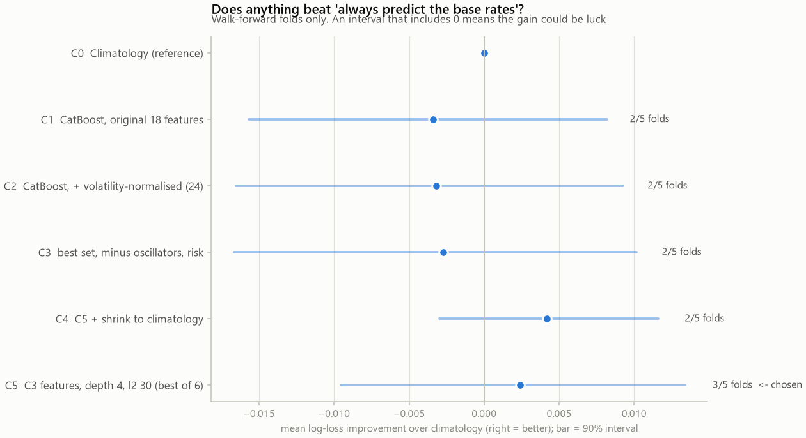

# Model A experiments (walk-forward folds only)
Protocol: candidates compared on the 5 walk-forward folds; the held-out year is opened once, for the winner.
Rule: needs >= 3/5 folds beating climatology, then highest mean improvement, ties within 0.002 go to the simpler candidate.

## Result
**Chosen: C5 - C3 features, depth 4, l2 30 (best of 6)** · beats climatology in 3/5 folds · mean improvement +0.0024 · its 90% interval INCLUDES 0 - the gain is not distinguishable from luck.
**Qualified under the rule: yes**

| ID | Candidate | Features | Folds beating | Mean gain | 90% interval | ECE |
|---|---|---|---|---|---|---|
| C1 | CatBoost, original 18 features | 18 | 2/5 | -0.0034 | [-0.0157, +0.0082] | 0.038 |
| C2 | CatBoost, + volatility-normalised (24) | 24 | 2/5 | -0.0032 | [-0.0165, +0.0093] | 0.035 |
| C3 | best set, minus oscillators, risk | 20 | 2/5 | -0.0027 | [-0.0167, +0.0102] | 0.039 |
| C4 | C5 + shrink to climatology | 20 | 2/5 | +0.0042 | [-0.0030, +0.0116] | 0.023 |
| C5 | C3 features, depth 4, l2 30 (best of 6) | 20 | 3/5 | +0.0024 | [-0.0095, +0.0134] | 0.031 |

## Feature-group ablation (from C2; removal helps if delta > 0)
| Group removed | Features removed | Mean gain | Delta vs full set | Folds beating |
|---|---|---|---|---|
| oscillators | 2 | -0.0019 | +0.0013 | 2/5 |
| risk | 2 | -0.0021 | +0.0011 | 2/5 |
| gvz | 2 | -0.0028 | +0.0004 | 2/5 |
| momentum | 5 | -0.0032 | +0.0000 | 2/5 |
| dollar_fx | 2 | -0.0032 | -0.0000 | 2/5 |
| rates | 2 | -0.0034 | -0.0002 | 2/5 |
| trend | 6 | -0.0057 | -0.0025 | 2/5 |
| volatility | 3 | -0.0101 | -0.0070 | 2/5 |

A group is dropped only if removing it improves the mean by >= 0.0005. Groups interact, so this is a one-pass screen, not proof that a dropped group is useless.

## Regularisation grid (C5)
| Config | Mean gain | Folds beating |
|---|---|---|
| depth 2, l2 10 | -0.0019 | 3/5 |
| depth 2, l2 30 | +0.0018 | 3/5 |
| depth 3, l2 10 | -0.0050 | 2/5 |
| depth 3, l2 30 | +0.0004 | 3/5 |
| depth 4, l2 10 | -0.0027 | 2/5 |
| depth 4, l2 30 | +0.0024 | 3/5 |

Six configurations were tried, so the best one is mildly optimistic (selection bias). That is why the interval column matters more than the point estimate.

C4 shrinkage weights learned per fold (1 = trust model fully, 0 = pure climatology): [0.0, 0.75, 0.45, 0.0, 1.0]