# Paun forecast models - evaluation report
Generated 2026-10-06 · data 2010-10-19 to 2026-09-29 (4010 labelled sessions) · held-out test year = last 252 sessions · horizon = 5 sessions

## Verdict
- **Model A (regime probabilities): DO NOT SHIP - show bands only**
- **Model B (price bands, EWMA): SHIP**

- *Rule A4 (statistical evidence of skill):* the out-of-fold log-loss improvement over climatology has a 90% interval of [-0.0095, +0.0134] - INCLUDES 0: the edge cannot be told apart from luck, so Model A is not shipped.

| Check | What it tests | Value | Rule | Result |
|---|---|---|---|---|
| A1 | Held-out year log-loss beats climatology | 1.004 | < 1.009 | PASS |
| A2 | Walk-forward folds beating climatology | 3 | >= 3 of 5 | PASS |
| A3 | Calibration error (ECE, out-of-fold) | 0.03137 | <= 0.05 | PASS |
| A4 | Gain over climatology is statistically real (90% interval lower bound) | -0.009537 | > 0 | FAIL |
| B1 | P10-P90 coverage (EWMA, held-out year) | 0.7935 | 0.75-0.85 | PASS |
| B2 | Pinball loss (EWMA) beats constant-vol baseline | 0.01005 | < 0.01060 | PASS |

## How to read this
- **Log-loss**: scores the probabilities themselves; confident wrong answers are punished hard. Lower is better. **Climatology** = always predict the historical class mix; any real model must beat it.
- **Walk-forward folds**: train on the past, test on the next unseen stretch, repeat 5 times. Never shuffled.
- **Calibration (ECE)**: do 40% predictions come true ~40% of the time? **Coverage**: how often the real price landed inside the P10-P90 band (ideal 80%).

## Labels
A day is **Bullish / Bearish** when gold's next-5-session move exceeds 0.75 x the expected move for current volatility (today's threshold is in the snapshot). Sideways = anything in between.

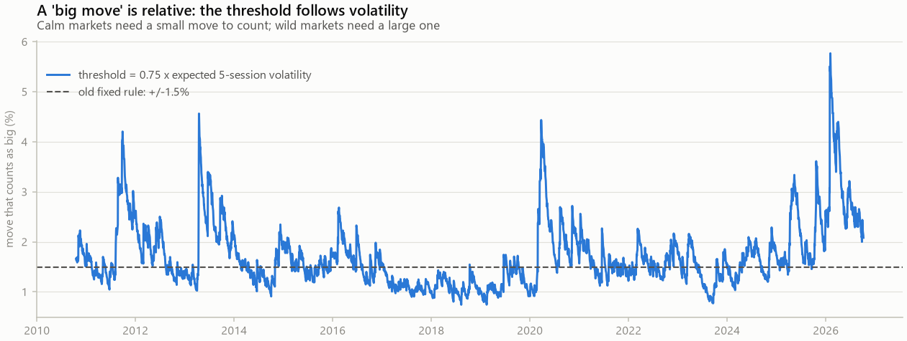
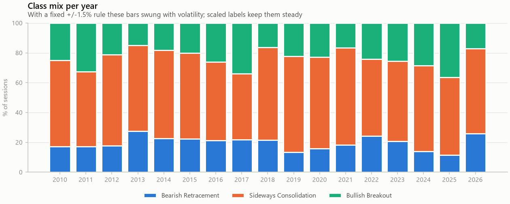

## Model A - regime classifier
| Fold | Validation period | Train rows | Log-loss | Climatology | Beats baseline |
|---|---|---|---|---|---|
| 1 | 2013-04-19 → 2015-10-09 | 623 | 0.9707 | 0.9729 | yes |
| 2 | 2015-10-12 → 2018-04-10 | 1248 | 1.0485 | 1.0390 | no |
| 3 | 2018-04-11 → 2020-10-01 | 1873 | 0.9533 | 0.9334 | no |
| 4 | 2020-10-02 → 2023-03-28 | 2498 | 0.9456 | 0.9643 | yes |
| 5 | 2023-03-29 → 2025-09-19 | 3123 | 0.9735 | 0.9939 | yes |

| Held-out year | Log-loss | Climatology | Brier | Accuracy | Macro-F1 |
|---|---|---|---|---|---|
| model | 1.0044 | 1.0088 | 0.5926 | 54.4% | 0.235 |

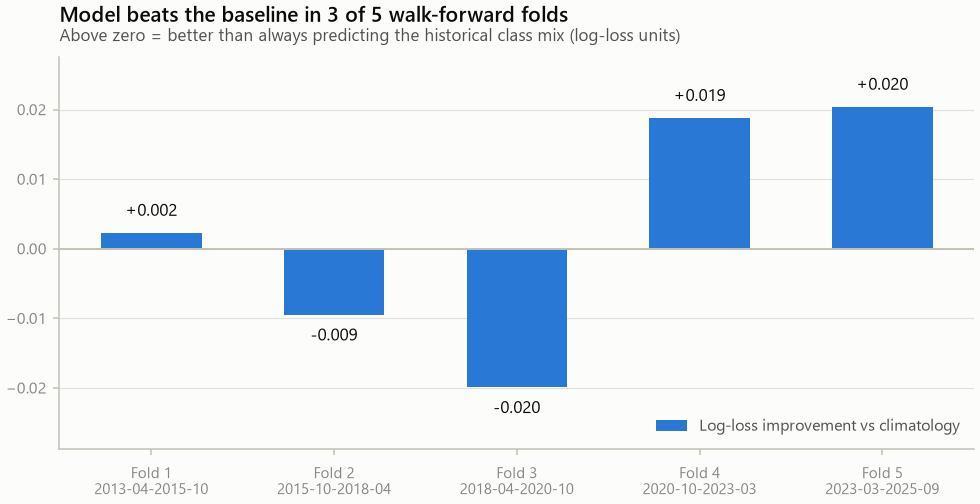
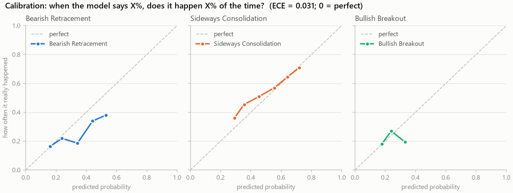
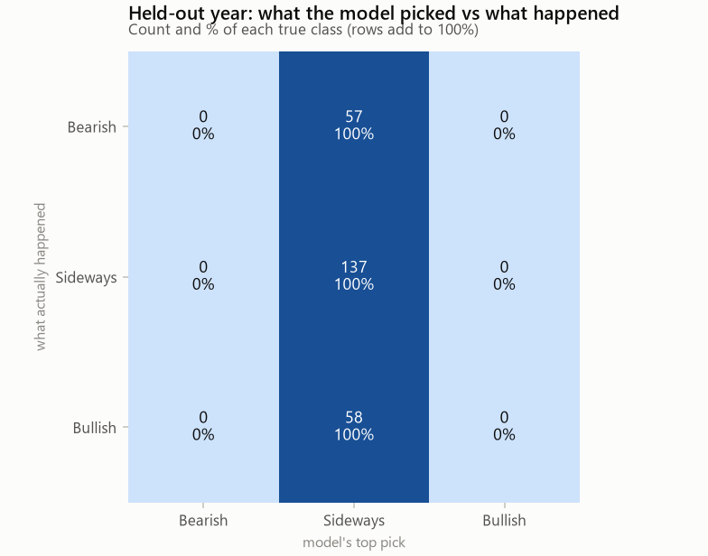
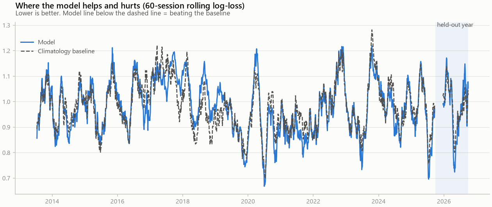
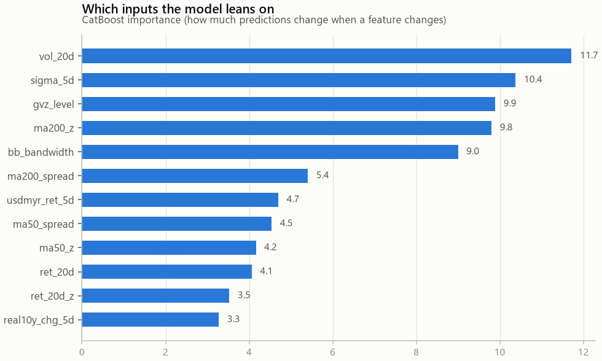

## Explainability (what the model leans on)
SHAP values explain each forecast exactly: baseline odds + each input's push = the model's output. They show what the model *used*, not what *caused* gold to move.

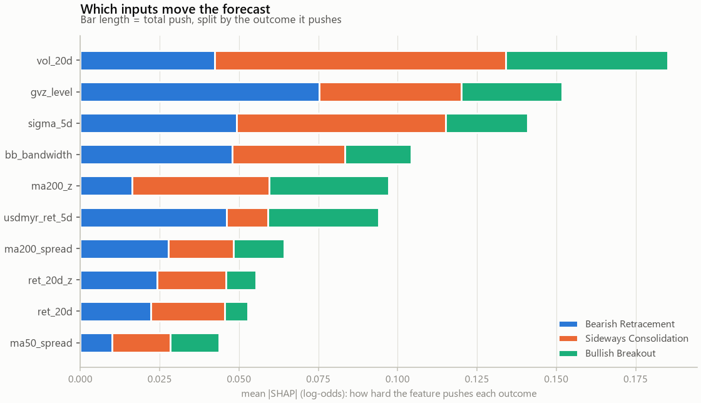
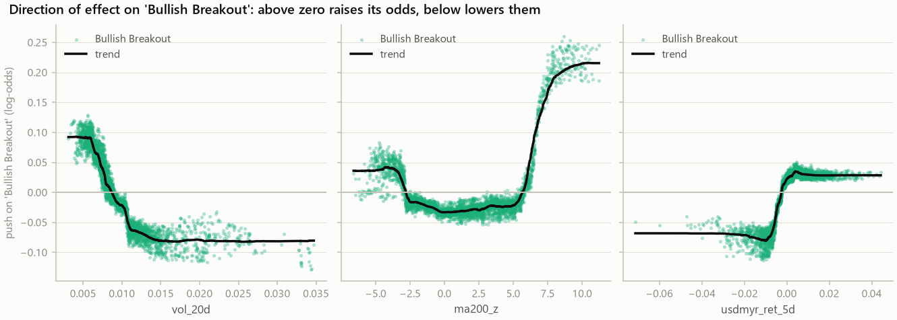
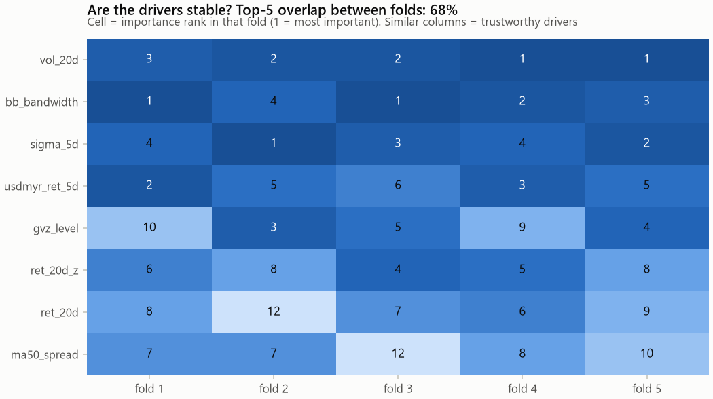

Driver stability: the top-5 inputs overlap 68% between walk-forward folds (low overlap = the model's reasoning changes with the period, a warning sign).

### Today's forecast, explained
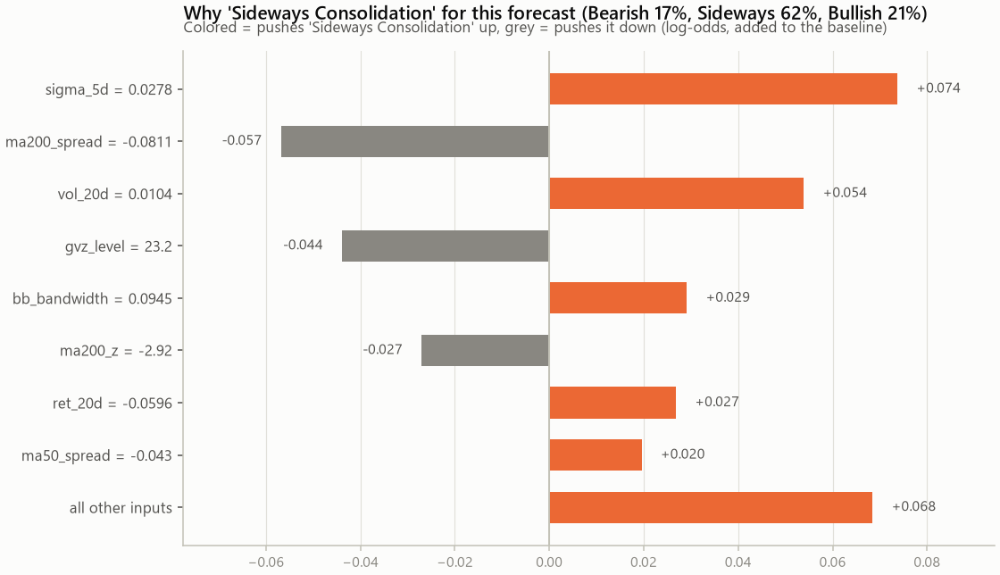

### Why the price band has its width
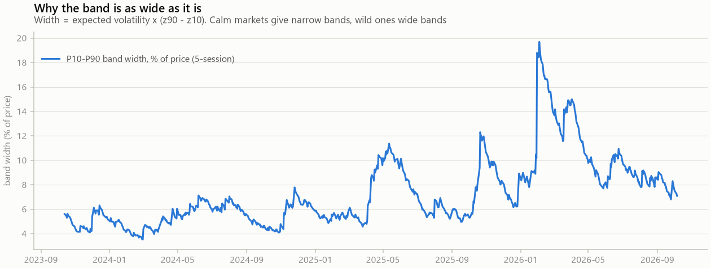

## Model B - volatility bands
| Method (held-out year) | P10-P90 coverage (ideal 80%) | Pinball loss (lower better) |
|---|---|---|
| GARCH(1,1) | 75.3% | 0.00998 |
| EWMA (λ=0.94) | 79.4% | 0.01005 |
| Constant-vol baseline | 49.8% | 0.01060 |

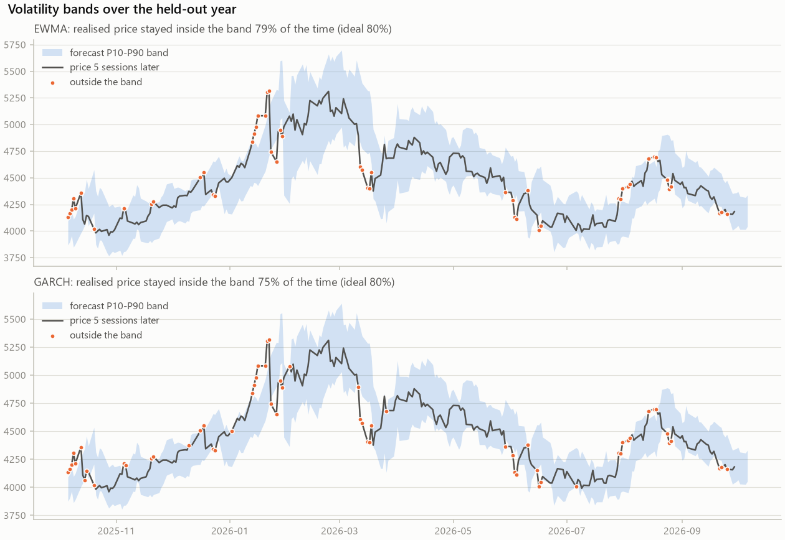

## Model file check
`regime.onnx` reproduces CatBoost probabilities to max |diff| = 1.4e-07 (ZipMap stripped: True).

## Feature glossary
| Feature | Meaning |
|---|---|
| vol_20d | Standard deviation of daily returns over 20 sessions - how jumpy gold has been lately. |
| sigma_5d | Expected size of gold's next-5-session move (EWMA volatility). Also sets today's 'big move' threshold. |
| gvz_level | CBOE Gold Volatility Index level - what options traders expect gold's volatility to be. |
| ma200_z | Distance from the 200-day average in units of expected volatility. |
| bb_bandwidth | Bollinger band width / price: how wide the 20-day +/-2 sigma envelope is (volatility, scaled). |
| ma200_spread | Price vs its 200-day average, in % - distance from the long-term trend. |
| usdmyr_ret_5d | 5-session change in USD/MYR - matters for the ringgit price Malaysians see. |
| ma50_spread | Price vs its 50-day average, in % - distance from the medium-term trend. |
| ma50_z | Distance from the 50-day average in units of expected volatility. |
| ret_20d | Gold's return over the last 20 sessions - medium-term momentum. |
| ret_20d_z | Last 20-session return measured in units of expected volatility. |
| real10y_chg_5d | 5-session change in the 10-year TIPS real yield - gold's classic opportunity cost. |
| ma20_z | Distance from the 20-day average in units of expected volatility. |
| gvz_chg_5d | 5-session change in GVZ - is expected volatility rising or falling. |
| us10y_chg_5d | 5-session change in the nominal US 10-year yield (percentage points). |
| ma20_spread | Price vs its 20-day average, in % - distance from the short-term trend. |
| dxy_ret_5d | 5-session change in the US Dollar Index. A stronger dollar usually weighs on gold. |
| ret_5d_z | Last 5-session return measured in units of expected volatility (a 'z-score' of momentum). |
| ret_5d | Gold's return over the last 5 sessions - short-term momentum. |
| ret_1d | Gold's return over the last 1 session (log return). |